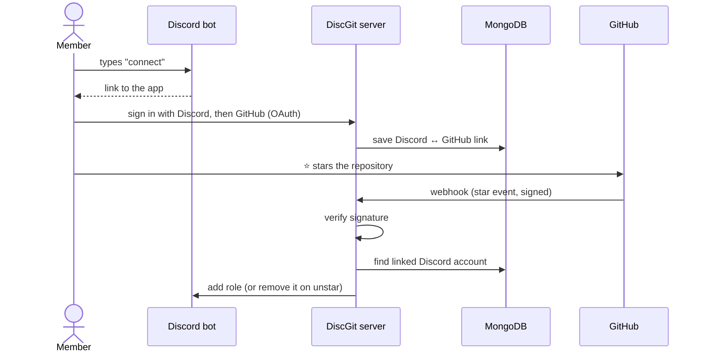

<h1 align="center">⭐ DiscGit Stars</h1>

<p align="center">
  <b>Reward your GitHub stargazers with a Discord role — automatically.</b>
</p>

<p align="center">
  
  
  
  
  
</p>

---

DiscGit links your community members' **Discord** and **GitHub** accounts. When someone **stars** your repository, they instantly get a role in your Discord server. If they remove the star, the role is removed too.

It's a simple way to thank supporters, unlock a "Stargazer" channel, or show who's backing your project.

## ✨ Features

- **One-click account linking.** Members sign in with Discord, then GitHub, and they're done.
- **Real-time role sync.** A GitHub webhook adds or removes the role as soon as someone stars or unstars.
- **Secure webhooks.** Every webhook request is verified against GitHub's `X-Hub-Signature-256` signature, so nobody can fake stars.
- **Persistent links.** Linked accounts are stored in MongoDB, so they survive restarts.
- **Built-in bot command.** Type `connect` in your server to get the link page.

## 🔄 How it works



## 📋 Prerequisites

- [Node.js](https://nodejs.org/) **20.19 or newer**, and [Yarn](https://classic.yarnpkg.com/) (or npm)
- A **MongoDB** database, either local or hosted (for example [MongoDB Atlas](https://www.mongodb.com/atlas))
- A **Discord server** where you can manage roles
- A **GitHub repository** you own (for the webhook)
- A public URL for the app. GitHub has to reach the webhook, so for local testing you'll need a tunnel (see [Local development](#-local-development))

## 🚀 Setup

### 1. Install

```bash
git clone https://github.com/antkarag13/discgit-auth.git
cd discgit-auth
yarn install
cp config.js.example config.js
```

`config.js` holds your secrets. It's in `.gitignore`, so it won't be committed.

### 2. Create the Discord application and bot

1. Open the [Discord Developer Portal](https://discord.com/developers/applications) and click **New Application**.
2. **Bot** tab:
   - Click **Reset Token** and copy the token into `token`.
   - Under **Privileged Gateway Intents**, turn on **Server Members Intent** and **Message Content Intent**.
3. **OAuth2** tab:
   - Copy the **Client ID** into `client_id` and the **Client Secret** into `client_secret`.
   - Add the redirect URL `<hostname>auth/discord/callback` (for example `https://stars.example.com/auth/discord/callback`).
4. Invite the bot to your server with the **Manage Roles** permission (**OAuth2 → URL Generator**, scopes `bot`, permission `Manage Roles`).

> [!IMPORTANT]
> In **Server Settings → Roles**, drag the bot's role **above** the reward role. Discord doesn't let bots assign roles that are higher than their own.

### 3. Create the GitHub OAuth app

1. Go to [GitHub → Settings → Developer settings → OAuth Apps](https://github.com/settings/developers) and click **New OAuth App**.
2. Set **Homepage URL** to your `hostname`, and **Authorization callback URL** to `<hostname>auth/github/callback`.
3. Copy the **Client ID** into `github_id`, and generate a **Client Secret** for `github_secret`.

### 4. Add the repository webhook

1. In your repository, go to **Settings → Webhooks → Add webhook**.
2. **Payload URL:** `<hostname>github`
3. **Content type:** either `application/json` or `application/x-www-form-urlencoded` works.
4. **Secret:** a long random string. Put the same value in `github_webhook_secret`.
5. **Which events?** Choose **Let me select individual events** and tick only **Stars**.

GitHub sends a `ping` right away. The app answers `Ignored`, which means the connection works.

### 5. Fill in the rest of `config.js` and start

Turn on **Developer Mode** in Discord (**User Settings → Advanced**) so you can right-click to copy the server ID and the role ID. Then run:

```bash
yarn start      # production
yarn dev        # auto-restart on file changes (nodemon)
```

You should see:

```
Server is up and running on port 4000
Connected to the Mongodb database.
YourBot#1234 is up and running!
```

## ⚙️ Configuration reference

| Key | Description |
| --- | --- |
| `token` | Discord bot token |
| `client_id` / `client_secret` | Discord application OAuth2 credentials |
| `mongodb` | MongoDB connection string, e.g. `mongodb://127.0.0.1:27017/discgit` |
| `passport_secret` | Random string used to sign session cookies |
| `github_id` / `github_secret` | GitHub OAuth app credentials |
| `github_webhook_secret` | Secret set on the repository webhook. Required: without it, every webhook request is rejected |
| `guild_id` | ID of your Discord server |
| `role_id` | ID of the role to give stargazers |
| `hostname` | Public URL of the app, **including** `http(s)://` and a trailing `/` (and the port for localhost) |
| `port` | Port the web server listens on (defaults to `4000`) |

Need a random secret? Run:

```bash
node -e "console.log(require('crypto').randomBytes(32).toString('hex'))"
```

## 💬 Usage

1. A member types **`connect`** in any channel the bot can read.
2. They click the link, authorize with **Discord**, then with **GitHub**.
3. They see *"You can now close this page!"*, which means their accounts are linked.
4. From then on, starring the repository gives them the role, and unstarring removes it.

> [!NOTE]
> Roles only change when a star event arrives. If someone starred the repository **before** linking, they can unstar and star again to get the role.

## 🧪 Local development

GitHub can't send webhooks to `localhost`, so expose your app with a tunnel such as [ngrok](https://ngrok.com/) or [smee.io](https://smee.io/):

```bash
ngrok http 4000
```

Use the tunnel URL (with a trailing `/`) as `hostname`, and update the Discord and GitHub callback URLs and the webhook Payload URL to match.

## 🛠️ Troubleshooting

| Problem | Fix |
| --- | --- |
| Webhook deliveries show **401 Invalid signature** | `github_webhook_secret` doesn't match the webhook's secret. |
| Webhook deliveries show **500 Webhook secret is not configured** | Add `github_webhook_secret` to `config.js`. |
| `Unable to log in the Discord bot` / `Used disallowed intents` | Enable the **Server Members** and **Message Content** intents in the Developer Portal. |
| Role isn't added | Make sure the bot has **Manage Roles**, its role is **above** the reward role, and the member is in the server. |
| The bot ignores `connect` | Enable the **Message Content** intent, and check the bot can read and send messages in that channel. |
| OAuth error `invalid redirect_uri` | The callback URLs must exactly match `<hostname>auth/discord/callback` and `<hostname>auth/github/callback`. |

## 📁 Project structure

```
├── server.js           # Express app, OAuth flow, webhook handler, Discord bot
├── models/Users.js     # Mongoose model for linked accounts
├── login.html          # "You're linked!" page
├── config.js.example   # Configuration template
└── package.json
```

## 📄 License

[MIT](LICENCE) © 2021 Antonis Karagiannis
